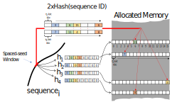
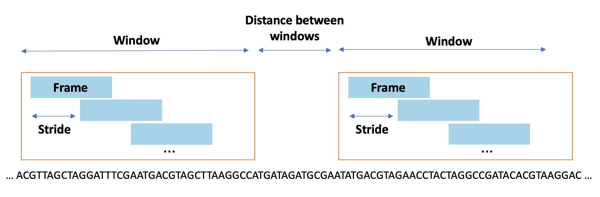

# Stash
###### Version 1.2.0
This repository contains the implementation for the **Stash** data structure and its utility in _de novo_ long read genome misassembly detection and correction.

# Dependencies
  * Compiler with OpenMP Support
  * [cmake](https://cmake.org/download/)
  * [btllib](https://github.com/bcgsc/btllib) v1.7.1-0

The dependencies can be installed through [Conda](https://docs.conda.io/en/latest/) package manager:
```
conda install -c anaconda cmake
conda install -c bioconda btllib
```

# Installation

To build Stash, run the following commands from within the `Stochastic_Tile_Hashing` directory:
```
cmake -S . -B Build
cd Build
make
```

Inside `Stochastic_Tile_Hashing/Build/Stash`, you can find an executable `Stash` and a static library `libStash.a`, which can be paired with the include directory at `Stochastic_Tile_Hashing/Stash/Include`.

# Usage
The Stash executable runs in two operation modes.

`fill`: Populates a Stash data structure given a set of reads. The size of the Stash will be `2 ^ (logRows + 3)` Bytes (e.g., for `logRows` equal to 30, Stash requires 8 GB of memory).
- **-r,-‌-reads:** Input Reads in Fasta Format
- **-o,-‌-output:** Output Path
- **-l,-‌-logRows:** Log2 of Number of Stash Rows (30)
- **-t,-‌-threads:** Number of Threads (8)

Example: `./Stash fill -r reads.fa -o stash.bin -l 30 -t 8`

- **-a,-‌-assembly:** Input Assembly in Fasta Format
- **-s,-‌-stash:** Input Stash Path
- **-o,-‌-output:** Output Path
- **-t,-‌-threads:** Number of Threads (8)
- **-n,-‌-number_of_frames:** Number of Frames (1)
- **-r,-‌-stride:** Stride (13)
- **-l,-‌-delta:** Delta (751)
- **-x,-‌-threshold:** Cut threshold (11)
- **-m,--max_pooling_radius:** Max-Pooling Radius (1)
- **-d,--min_cut_distance:** Minimum Cut Distance (1000)

`cut`: Attempts to reduce the number of misassemblies in a given assembly by cutting misassembled contigs.

Example: `./Stash cut -a assembly.fa -o output.fa -s stash.bin -t 8`

# Misassembly Detection Demo
The `TestData` directory in the repository contains a toy read set and a toy assembly to showcase Stash's ability to correct misassemblies. The `test_reads.fa` includes 14 duplicate reads that can be inserted into Stash with the following command.
- `./Stash fill -r test_reads.fa -o stash.bin`

The assembly `test_assembly.fa` contains similar subsequences as the read set, with a previously unseen sequence in the middle. The following command is able to cut the assembly into parts to correct the misassembled patterns.
- `./Stash cut -a test_assembly.fa -o corrected_assembly.fa -s stash.bin`

# Introduction to Stash

### Stash

A new Stash data structure can be created using the `Stash( uint32_t logRows, const std::vector< std::string >& spacedSeeds )` constructor.
* `logRows`: Determines the number of rows in Stash as 2 ^ logRows.
* `spacedSeeds`: A vector of strings, where each string represents a spaced seed frame.

Calling `void save( const char* path )` on a created Stash stores its data and all parameters into a binary file. The saved Stash can be later restored using the `Stash( const char* path )` constructor.

In the following figure, you can see a visualization of the Stash data structure: algorithm and sequence data population process with 4 spaced seed patterns (h1-h4). In order to combine the spaced seed output values with the two sequence ID hashes, for the i_th spaced seed pattern, the i_th most significant bits of the other spaced seed pattern outputs are concatenated in order to address an index in the sequence ID hash tiles, which would specify the column and the stored tile value in Stash.




### Frames

A frame is defined as the set of Stash rows accessed for a given spaced seed frame. Specifically, it is a two-dimensional array of tiles with width='number of spaced seeds' and height='number of Stash columns'. A metric called _Number of Matches_ can be defined between two Stash frames. For related frames, this value is relatively larger than the value for unrelated frames. In the problem of genome misassembly detection, the _Number of Matches_ metric represents the number of overlapping sequencing reads that cover a genomic region (coverage by read set). 

### Windows of Frames

A schematic of how windows of frames are designed is provided below. Each window consists of a set of frames that have a distance of stride from each other. We compare two windows by counting the maximum number of matches between all pairs of their frames, in order to have a more general view of a genomic region and also ignore sequence errors and gaps.



# Presentations
* Sarvar, A., Coombe, L., Warren, R., & Birol, I. (2023, April 14–19). Stash: A data structure based on stochastic tile hashing [Conference presentation]. RECOMB-Seq Satellite Conference on Biological Sequence Analysis 2023, Istanbul, Turkey.

* Sarvar, A., Coombe, L., Warren, R., & Birol, I. (2022, July 10–14). Genome misassembly detection using Stash: A data structure based on stochastic tile hashing [Conference presentation]. Intelligent Systems for Molecular Biology 2022, Madison, WI, United States.

# Credits
* Research concept and design: Inanc Birol and Armaghan Sarvar<br/>
* Implementation and experimentation: Armaghan Sarvar<br/>
* Additional feedback: Lauren Coombe, René Warren
