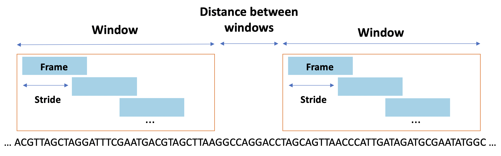

# Stash: A Data Structure for Genome Misassembly Detection and Correction

[](https://github.com/bcgsc/stash)
[](LICENSE)
[]()

## Overview


### Key Features

- **Efficient Data Structure**: Stochastic tile hashing for rapid sequence comparison
- **Memory Scalable**: Configurable memory usage based on dataset size
- **Multi-threaded**: OpenMP support for parallel processing
- **Two-stage Pipeline**: Separate fill and cut operations for optimal performance
- **Robust Detection**: Handles sequence errors and gaps in genomic data

## Table of Contents

- [Installation](#installation)
- [Quick Start](#quick-start)
- [Usage](#usage)
- [Algorithm Overview](#algorithm-overview)
- [API Documentation](#api-documentation)
- [Demo](#demo)
- [Publications](#publications)
- [Contributing](#contributing)
- [License](#license)

## Installation

### Prerequisites

- **Compiler**: C++ compiler with OpenMP support (GCC 4.9+ or Clang 3.5+)
- **Build System**: [CMake](https://cmake.org/download/) 3.10 or higher
- **Dependencies**: [btllib](https://github.com/bcgsc/btllib) v1.7.1-0

### Dependency Installation

Install dependencies using [Conda](https://docs.conda.io/en/latest/):

```bash
conda install -c anaconda cmake
conda install -c bioconda btllib
```

### Building from Source

Clone the repository and build Stash:

```bash
git clone <repository-url>
cd Stochastic_Tile_Hashing
cmake -S . -B Build
cd Build
make
```

### Build Output

After successful compilation, you will find:
- **Executable**: `Stochastic_Tile_Hashing/Build/Stash/Stash`
- **Static Library**: `Stochastic_Tile_Hashing/Build/Stash/libStash.a`
- **Headers**: `Stochastic_Tile_Hashing/Stash/Include/`

## Quick Start

1. **Fill a Stash** with your sequencing reads:
   ```bash
   ./Stash fill -r reads.fa -o stash.bin -l 30 -t 8
   ```

2. **Detect and correct misassemblies** in your assembly:
   ```bash
   ./Stash cut -a assembly.fa -o corrected_assembly.fa -s stash.bin -t 8
   ```

## Usage

The Stash executable operates in two distinct modes:

### Fill Mode

Populates a Stash data structure with sequencing reads for subsequent analysis.

**Memory Requirements**: The Stash size is `2^(logRows + 3)` bytes. For example, with `logRows=30`, Stash requires 8 GB of memory.

#### Parameters

| Parameter | Short | Description | Default |
|-----------|-------|-------------|---------|
| `--reads` | `-r` | Input reads in FASTA format | Required |
| `--output` | `-o` | Output Stash file path | Required |
| `--logRows` | `-l` | Log₂ of number of Stash rows | 30 |
| `--threads` | `-t` | Number of processing threads | 8 |

#### Example

```bash
./Stash fill -r reads.fa -o stash.bin -l 30 -t 8
```

### Cut Mode

Analyzes an assembly against a populated Stash to detect and correct misassemblies.

#### Parameters

| Parameter | Short | Description | Default |
|-----------|-------|-------------|---------|
| `--assembly` | `-a` | Input assembly in FASTA format | Required |
| `--stash` | `-s` | Input Stash file path | Required |
| `--output` | `-o` | Corrected assembly output path | Required |
| `--threads` | `-t` | Number of processing threads | 8 |
| `--number_of_frames` | `-n` | Number of frames for analysis | 1 |
| `--stride` | `-r` | Stride between frames | 13 |
| `--delta` | `-l` | Delta parameter | 751 |
| `--threshold` | `-x` | Cut threshold for misassembly detection | 11 |
| `--max_pooling_radius` | `-m` | Maximum pooling radius | 1 |
| `--min_cut_distance` | `-d` | Minimum distance between cuts | 1000 |

#### Example

```bash
./Stash cut -a assembly.fa -o corrected_assembly.fa -s stash.bin -t 8
```

## Algorithm Overview

### Stash Data Structure

The Stash data structure implements stochastic tile hashing for efficient sequence comparison. A new Stash can be created using:

```cpp
Stash(uint32_t logRows, const std::vector<std::string>& spacedSeeds)
```

**Constructor Parameters:**
- `logRows`: Determines the number of rows as 2^logRows
- `spacedSeeds`: Vector of strings representing spaced seed frames

**Persistence:**
- `void save(const char* path)`: Saves Stash data and parameters to binary file
- `Stash(const char* path)`: Restores Stash from saved binary file

The following figure illustrates the Stash data structure algorithm and sequence data population process with 4 spaced seed patterns (h1-h4). The algorithm combines spaced seed output values with sequence ID hashes, where for the i-th spaced seed pattern, the i-th most significant bits of other spaced seed pattern outputs are concatenated to address an index in the sequence ID hash tiles, specifying the column and stored tile value in Stash.


### Frames

A **frame** represents the set of Stash rows accessed for a given spaced seed frame. It is implemented as a two-dimensional array of tiles with:
- **Width**: Number of spaced seeds
- **Height**: Number of Stash columns

**Number of Matches Metric**: Defined between two Stash frames, this metric quantifies sequence similarity. For related frames, this value is significantly larger than for unrelated frames. In genome misassembly detection, this metric represents the number of overlapping sequencing reads covering a genomic region (read set coverage).

### Windows of Frames

Windows of frames provide a robust approach to genomic region analysis. Each window consists of frames separated by a stride distance. Windows are compared by counting the maximum number of matches between all frame pairs, providing:

- **General genomic region view**: Comprehensive analysis beyond individual frames
- **Error tolerance**: Robust handling of sequence errors and gaps
- **Improved accuracy**: Statistical significance through multiple frame comparisons



## API Documentation

### C++ API

The Stash library provides a C++ API for integration into custom applications:

```cpp
#include "Stash/Include/Stash.h"

// Create a new Stash
Stash stash(30, spacedSeeds);

// Save to file
stash.save("my_stash.bin");

// Load from file
Stash loadedStash("my_stash.bin");
```

### Linking

Link against the static library:

```bash
g++ -o my_program my_program.cpp -L./Stash -lStash -fopenmp
```

## Demo

The `TestData` directory contains example datasets to demonstrate Stash's capabilities:

### Test Dataset

- **`test_reads.fa`**: 14 duplicate reads for Stash population
- **`test_assembly.fa`**: Assembly with misassembled patterns

### Running the Demo

1. **Populate Stash** with test reads:
   ```bash
   ./Stash fill -r test_reads.fa -o stash.bin
   ```

2. **Correct misassemblies** in test assembly:
   ```bash
   ./Stash cut -a test_assembly.fa -o corrected_assembly.fa -s stash.bin
   ```

The corrected assembly will have misassembled patterns identified and appropriately segmented.

## Publications

### Conference Presentations

- **Sarvar, A., Coombe, L., Warren, R., & Birol, I.** (2023, April 14–19). *Stash: A data structure based on stochastic tile hashing* [Conference presentation]. RECOMB-Seq Satellite Conference on Biological Sequence Analysis 2023, Istanbul, Turkey.

- **Sarvar, A., Coombe, L., Warren, R., & Birol, I.** (2022, July 10–14). *Genome misassembly detection using Stash: A data structure based on stochastic tile hashing* [Conference presentation]. Intelligent Systems for Molecular Biology 2022, Madison, WI, United States.

## Contributing

We welcome contributions to improve Stash! Please see our [Contributing Guidelines](CONTRIBUTING.md) for details on:

- Code style and standards
- Testing requirements
- Pull request process
- Issue reporting

## License

This project is licensed under the MIT License - see the [LICENSE](LICENSE) file for details.

## Credits

- **Research concept and design**: Inanc Birol and Armaghan Sarvar
- **Implementation and experimentation**: Armaghan Sarvar
- **Feedback and guidance**: Lauren Coombe, René Warren

---

*For questions, issues, or feature requests, please visit our [GitHub Issues](https://github.com/bcgsc/stash/issues) page.*

